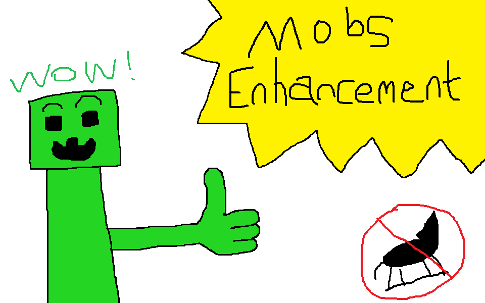

# Mobs Enhancement Addon

This is a Minecraft Better Than Wolves addon that aims to slightly strengthen mobs, adding difficulty to the game.

## Features

### All Mobs

- Mobs enjoy increased melee attack reach distance when holding a tool.
- Mobs' senses are strengthened, with further target distance and more points to check, instead of only doing an eye-to-eye check.
- Mobs cannot see entities behind them unless they are very close.
- Mobs can see through transparent blocks such as glass, leaves.
- Mobs no longer try to watch the closest player.

### Zombies

- Zombies are able to break certain types of blocks blocking the way to their attack target, determined by their held item.
- Zombies have a chance to be able to sense targets through opaque blocks.

### Skeletons

- Skeletons move faster.
- Skeletons have a chance to spawn with a melee weapon instead of a bow.
- Skeletons predict their target's position before ranged attacks.
- Skeletons try not to get too close to dangerous targets when holding a bow.
- Skeletons flee from dangerous targets when their health is low.
- Skeletons' max health is decreased from 20 to 16.
- Skeletons target villagers.
- Skeletons try to break nearby burning torches.
- Skeletons have a chance to be able to sense targets through opaque blocks.
- Skeletons try to flee from explosions.

### Creepers

- Creepers' fuse time is decreased from 1.5 seconds to 1 second.
- Creepers' explosions spawn at the center of them, instead of the bottom.
- Creepers have a chance to instantly explode when interacted with shears.
- Creepers explode when damaged by explosions.
- Creepers don't immediately stop fusing on sight being blocked.
- Creepers have a chance to be able to sense targets through opaque blocks.

### Witches

- Witches move faster.
- Witches predict their target's position before throwing potions.
- Witches try not to get too close to dangerous targets.
- Witches target villagers.
- Witches have a chance to be able to sense targets through opaque blocks.
- Witches try to flee from explosions.

### Spiders

- Cobwebs don't only slow down entities' move speed, but also make players hardly rotate their look direction.

### Slimes

- One of the slimes that big slimes and medium core slimes split into on death becomes a core slime, whose texture is slightly different from ordinary ones.
- Core slimes attract nearby ordinary slimes to approach them, and finally merge into them to become one larger slime.

### Silverfish

- Infested stones generate in all biomes; the deeper, the more.
- When attacked, instead of taking damage, silverfish split into two, each of them with half the health of their mother.

### Zombie Pigmen

- Zombie pigmen are able to break certain types of blocks blocking the way to their attack target, determined by their held item.
- Zombie pigmen get invoked by creatures that are too close to them.

### Magma Cubes

- Small magma cubes melt into a puddle of lava on death.
- Magma cubes regenerate their health when touching lava.

### Ghasts

- Ghasts have a translucent look.
- Arrows and throwable items cannot collide with ghasts, instead fly through them.
- Ghasts only take damage from fireballs and magic.

### Withers

- Withers follow their attack target at a larger distance.
- Withers sometimes summon wither skeletons when their health is above half.
- Withers sometimes dash toward their attack target when their health is below half.

### Endermen

- Players' gloom level rapidly increase when starring at an enderman.
- Players' gloom level rapidly increase when being too close to an enderman.

### Ender Dragons

- When hit, instead of disappearing, ender crystals become dried, in this state they cannot heal the ender dragon.
- When hit, ender crystals avenge the attacker with a lightning bolt.
- Ender crystals try to charge nearby dried crystals, helping them restore vitality.
- Players' gloom level rapidly increase when being close to an ender dragon.

### Spawners

- Spawners curse nearby players with negative potion effects when broken.

### Passive Mobs

- Villagers and pigs try to flee from explosions.